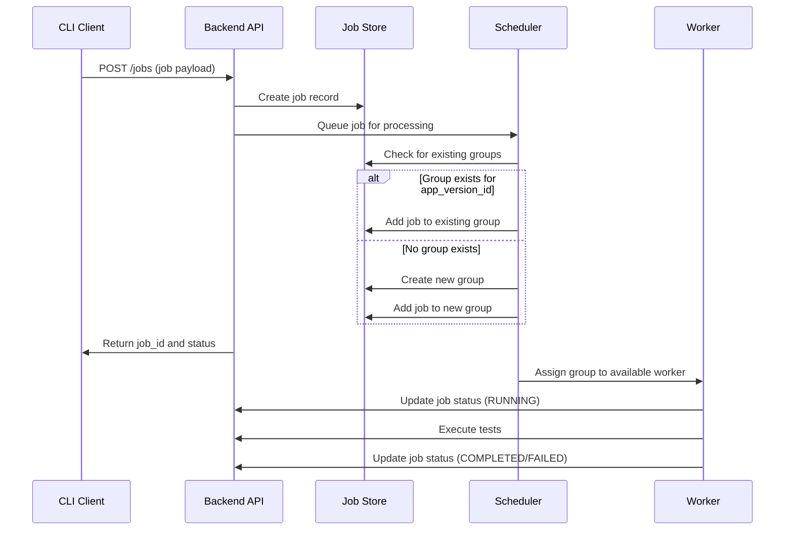
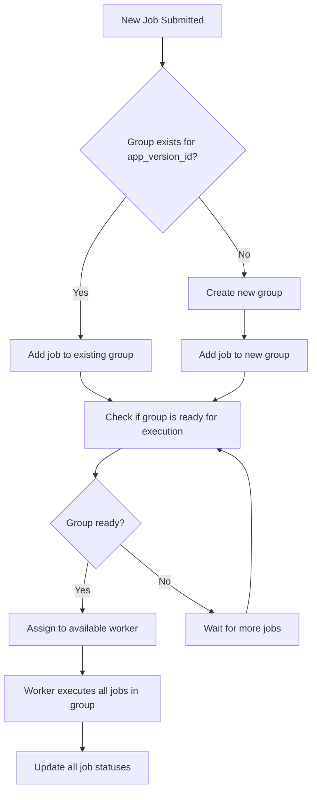

# TestPilot Architecture Design

## Overview

TestPilot is a test automation orchestration platform designed to improve efficiency in mobile app testing by intelligently grouping tests by app version to reduce redundant app installations. The system provides a scalable, reliable, and modular solution for managing test execution across multiple workers.

## System Architecture

```
┌─────────────────────────────────────────────────────────────────────────────┐
│                              TestPilot Architecture                         │
├─────────────────────────────────────────────────────────────────────────────┤
│                                                                             │
│  ┌─────────────────┐    ┌─────────────────┐    ┌─────────────────┐          │
│  │   CLI Client    │    │   Web Client    │    │  CI/CD Pipeline  │         │
│  │   (qgjob)       │    │   (Browser)     │    │  (GitHub Actions)│         │
│  └─────────┬───────┘    └─────────┬───────┘    └─────────┬───────┘          │
│            │                      │                      │                  │
│            └──────────────────────┼──────────────────────┘                  │
│                                   │                                         │
│  ┌────────────────────────────────┼─────────────────────────────────────┐   │
│  │                    Backend API Service (Flask)                       │   │
│  │  ┌─────────────┐  ┌─────────────┐  ┌─────────────┐  ┌─────────────┐   │  │
│  │  │   Job Store │  │  Scheduler  │  │   Workers   │  │   Groups    │   │  │
│  │  │   Manager   │  │   Manager   │  │   Manager   │  │   Manager   │   │  │
│  │  └─────────────┘  └─────────────┘  └─────────────┘  └─────────────┘   │  │
│  └─────────────────────────────────────────────────────────────────────┘ │  │
│                                    │                                        │
│  ┌─────────────────────────────────┼─────────────────────────────────────┐  │
│  │                    Storage Layer                                     │   │
│  │  ┌─────────────────┐    ┌─────────────────┐                          │   │
│  │  │   Redis Store   │    │  In-Memory Store│                          │   │
│  │  │   (Primary)     │    │   (Fallback)    │                          │   │
│  │  └─────────────────┘    └─────────────────┘                          │   │
│  └─────────────────────────────────────────────────────────────────────┘    │
│                                    │                                        │
│  ┌─────────────────────────────────┼─────────────────────────────────────┐  │
│  │                    Worker Layer                                       │  │
│  │  ┌─────────────┐  ┌─────────────┐  ┌─────────────┐  ┌─────────────┐   │  │
│  │  │   Worker 1  │  │   Worker 2  │  │   Worker 3  │  │   Worker N  │   │  │
│  │  │ (Emulator)  │  │  (Device)   │  │(BrowserStack)│ │  (Scalable) │   │  │
│  │  └─────────────┘  └─────────────┘  └─────────────┘  └─────────────┘   │  │
│  └─────────────────────────────────────────────────────────────────────┘ │  │
│                                                                             │
└─────────────────────────────────────────────────────────────────────────────┘
```

## Core Components

### 1. CLI Client (`cli/qgjob/`)

**Purpose**: Command-line interface for job submission and management

**Key Features**:

- Job submission with various parameters
- Real-time status monitoring
- Job listing and filtering
- Server health checks
- Colored output and user-friendly interface

**Commands**:

- `submit`: Submit new test jobs
- `status`: Check job status
- `list`: List jobs with filtering
- `stats`: View system statistics
- `health`: Check server health

### 2. Backend API Service (`backend/`)

**Purpose**: RESTful API service built with Flask

**Core Modules**:

#### Job Store Manager (`job_store.py`, `redis_job_store.py`)

- **Primary**: Redis-backed storage for persistence and scalability
- **Fallback**: In-memory storage for development/testing
- **Features**: Automatic fallback, job CRUD operations, group management

#### Scheduler Manager (`scheduler.py`)

- **Purpose**: Intelligent job scheduling and grouping
- **Features**:
  - App version-based job grouping
  - Priority-based scheduling
  - Retry logic with exponential backoff
  - Worker load balancing

#### Workers Manager

- **Purpose**: Worker registration and management
- **Features**: Heartbeat monitoring, status tracking, capacity management

#### Groups Manager

- **Purpose**: Job group lifecycle management
- **Features**: Group creation, status tracking, worker assignment

### 3. Shared Data Models (`shared/schemas.py`)

**Purpose**: Common data structures and validation

**Key Models**:

- `Job`: Complete job record with status tracking
- `JobPayload`: Job submission data
- `JobGroup`: Group of jobs sharing app version
- `Worker`: Worker/agent representation
- `JobStatus`, `JobTarget`, `JobPriority`: Enumerations

### 4. Storage Layer

#### Redis Store (Primary)

- **Purpose**: Persistent, scalable storage
- **Features**:
  - Job persistence across restarts
  - Horizontal scalability
  - Pub/sub for real-time updates
  - Atomic operations for consistency

#### In-Memory Store (Fallback)

- **Purpose**: Development and testing
- **Features**:
  - No external dependencies
  - Fast startup
  - Automatic fallback when Redis unavailable

## Data Flow

### Job Submission Flow



### Job Grouping Logic



## Key Design Decisions

### 1. Job Grouping Strategy

**Problem**: Multiple tests for the same app version require redundant app installations
**Solution**: Group jobs by `app_version_id` to batch installations
**Benefits**:

- 50%+ reduction in app installation time
- Improved resource utilization
- Better worker efficiency

### 2. Storage Architecture

**Primary**: Redis for production scalability
**Fallback**: In-memory for development
**Benefits**:

- No single point of failure
- Easy development setup
- Production-ready scalability

### 3. Modular Design

**Separation of Concerns**:

- CLI: User interface and client logic
- Backend: Business logic and API
- Shared: Data models and validation
- Storage: Abstraction layer for persistence

**Benefits**:

- Easy testing and maintenance
- Independent scaling of components
- Clear interfaces between layers

### 4. Retry and Failure Handling

**Strategy**: Exponential backoff with configurable retries
**Implementation**:

- Job-level retry tracking
- Automatic retry scheduling
- Failure categorization
- Dead letter queue for failed jobs

### 5. Worker Management

**Features**:

- Dynamic worker registration
- Heartbeat monitoring
- Load balancing
- Target type specialization
- Capacity tracking

## Scalability Considerations

### Horizontal Scaling

1. **Multiple API Instances**: Load balancer distributes requests
2. **Redis Cluster**: For high availability and performance
3. **Worker Scaling**: Add/remove workers based on load
4. **Database Sharding**: By organization ID for multi-tenancy

### Performance Optimizations

1. **Job Grouping**: Reduces redundant operations
2. **Redis Caching**: Fast job status lookups
3. **Connection Pooling**: Efficient database connections
4. **Async Processing**: Non-blocking job scheduling

### Monitoring and Observability

1. **Health Checks**: `/health` endpoint for monitoring
2. **Statistics**: `/stats` endpoint for metrics
3. **Logging**: Structured logging for debugging
4. **Metrics**: Job success rates, processing times

## Security Considerations

1. **Input Validation**: All user inputs validated
2. **Rate Limiting**: Prevent API abuse
3. **Authentication**: Organization-based access control
4. **Data Isolation**: Jobs isolated by organization
5. **Secure Communication**: HTTPS for API endpoints

## Deployment Architecture

```
┌─────────────────────────────────────────────────────────────────────────────┐
│                              Production Deployment                          │
├─────────────────────────────────────────────────────────────────────────────┤
│                                                                             │
│  ┌─────────────────┐    ┌─────────────────┐    ┌─────────────────┐         │
│  │   Load Balancer │    │   Load Balancer │    │   Load Balancer │         │
│  │   (nginx)       │    │   (nginx)       │    │   (nginx)       │         │
│  └─────────┬───────┘    └─────────┬───────┘    └─────────┬───────┘         │
│            │                      │                      │                 │
│  ┌─────────▼───────┐    ┌─────────▼───────┐    ┌─────────▼───────┐         │
│  │   API Instance  │    │   API Instance  │    │   API Instance  │         │
│  │   (Flask App)   │    │   (Flask App)   │    │   (Flask App)   │         │
│  └─────────┬───────┘    └─────────┬───────┘    └─────────┬───────┘         │
│            │                      │                      │                 │
│            └──────────────────────┼──────────────────────┘                 │
│                                   │                                        │
│  ┌─────────────────────────────────┼─────────────────────────────────────┐ │
│  │                    Redis Cluster                                     │ │
│  │  ┌─────────────┐  ┌─────────────┐  ┌─────────────┐                    │ │
│  │  │   Redis 1   │  │   Redis 2   │  │   Redis 3   │                    │ │
│  │  │  (Master)   │  │  (Replica)  │  │  (Replica)  │                    │ │
│  │  └─────────────┘  └─────────────┘  └─────────────┘                    │ │
│  └─────────────────────────────────────────────────────────────────────┘ │
│                                                                             │
│  ┌─────────────────────────────────────────────────────────────────────┐   │
│  │                    Worker Pool                                       │   │
│  │  ┌─────────────┐  ┌─────────────┐  ┌─────────────┐  ┌─────────────┐ │   │
│  │  │   Worker 1  │  │   Worker 2  │  │   Worker 3  │  │   Worker N  │ │   │
│  │  │ (Auto-scaled)│  │ (Auto-scaled)│  │ (Auto-scaled)│  │ (Auto-scaled)│ │   │
│  │  └─────────────┘  └─────────────┘  └─────────────┘  └─────────────┘ │   │
│  └─────────────────────────────────────────────────────────────────────┘   │
│                                                                             │
└─────────────────────────────────────────────────────────────────────────────┘
```

## Future Enhancements

1. **Microservices Architecture**: Split into separate services
2. **Event-Driven Architecture**: Message queues for job processing
3. **Container Orchestration**: Kubernetes deployment
4. **Advanced Analytics**: Job performance insights
5. **Multi-Region Support**: Global deployment
6. **Plugin System**: Extensible worker types
7. **Real-time Notifications**: WebSocket support
8. **Advanced Scheduling**: Machine learning-based optimization

## Conclusion

TestPilot's architecture provides a robust, scalable, and efficient solution for test automation orchestration. The modular design, intelligent job grouping, and comprehensive failure handling make it suitable for both development and production environments. The system's ability to automatically fall back to in-memory storage ensures easy setup while Redis integration provides enterprise-grade scalability.
